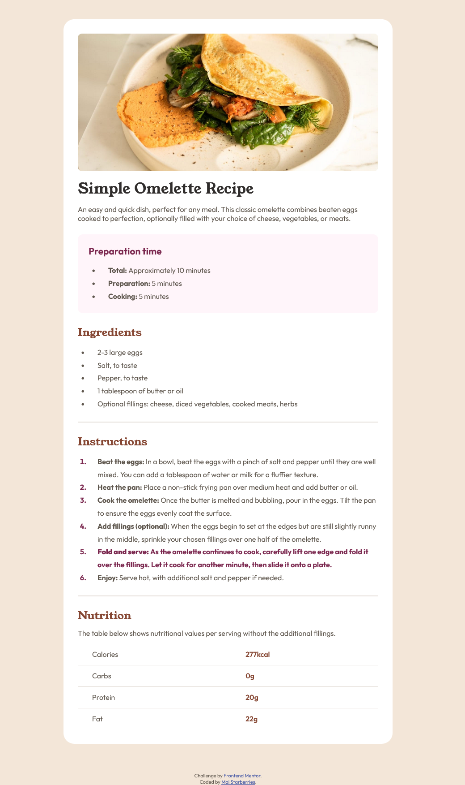

# Frontend Mentor - Recipe page solution

This is a solution to the [Recipe page challenge on Frontend Mentor](https://www.frontendmentor.io/challenges/recipe-page-KiTsR8QQKm). Frontend Mentor challenges help you improve your coding skills by building realistic projects. 

## Table of contents

- [Overview](#overview)
  - [The challenge](#the-challenge)
  - [Screenshot](#screenshot)
  - [Links](#links)
- [My process](#my-process)
  - [Built with](#built-with)
  - [What I learned](#what-i-learned)
  - [Continued development](#continued-development)
- [Author](#author)

## Overview

### Screenshot

### Links

- Solution URL: [GitHub](https://github.com/starberries/recipes-page)
- Live Site URL: [GitHub Pages Site](https://starberries.github.io/recipe-pages/)

## My process

### Built with

- Semantic HTML5 markup
- CSS custom properties

### What I learned

For this exercise, I was able to further explore a number of different topics:
- Styling the `hr` element
- Styling tables and vertical table organization
- Styling the count numbers of `ol` and `li` elements using `counter-reset` and `counter-increment`. I didn't end up using these in the final result, as it was just easier to accomplish the correct positioning and alignment with additional organizing of HTML tags and simpler styling, but that'll likely be useful information going forward.

### Continued development

I definitely had to reorganize the way I did the HTML and CSS at a few different points throughout this, owing largely to a lack of planning, so it'll be nice to work on that more going forward. Knowing more about how to style and organize different types of elements and layouts as I progress will also do a lot to make that easier.

## Author

- Me! - [The Starberries](https://starberries.github.io/social-links-profile/)
- GitHub - [starberries](https://github.com/starberries)
- Frontend Mentor - [@yourusername](https://www.frontendmentor.io/profile/starberries)